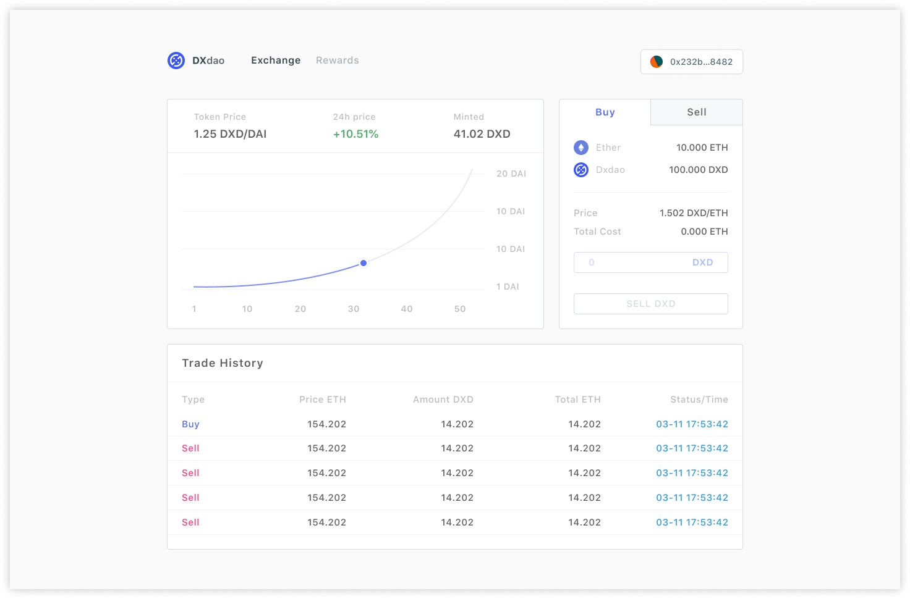
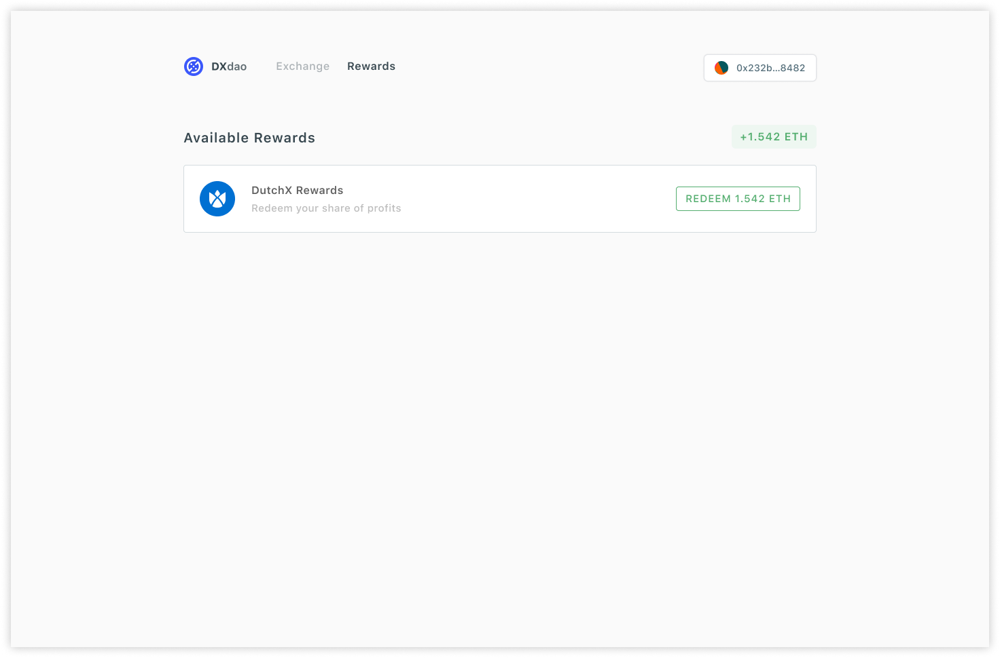

# BC-DAPP Proposal

> A proposal by the BC-DAPP team to build a full DApp which will allow investors to participate in the continuous fundraising efforts of the DXdao.

## Overview

This proposal is to build a DApp that facilitates interaction with the continuous fundraising token deployed by the DXdao. This includes a full trading interface to buy and sell tokens and an interface to view and claim dividends earned by holding these tokens.

## Requirements

Here is a high-level overview of the project's requirements:

1. Full spec and visual mockups of all user flows
2. Overview of potential curve economics
3. Trading interface for investors to buy and sell DXD tokens using the bonding curve
4. Dividend claim interface for token holders to view and claim dividends from DXdao cash flow
5. Custom bonding curve to facilitate initial distribution of DXD to DXdao Rep holders
6. Improve UX by supporting native ETH as reserve currency in Bonding Curve
7. Deployment and decentralized hosting support for the DApp (ENS+IPFS, hosted on DXdao.eth)

## Budget

- 70,000 GEN
- 50 ETH, payable in DAODebt.
- 94,000 of DXdao REP (approx. 10% of existing REP)

  - 60% of total to [dOrg](https://dorg.tech/#/) (56,400 Rep)

    0xbe1a98d3452f6da6e0984589e545d4fc25af7526

  - 20% of total to [LevelK](https://www.levelk.io) (18,800 Rep)

    0x583aCC79585D3cB195EA8125F6F80aD459B46313

  - 20% of total to Corkus (18,800 Rep)

    0x730fd267ef60b27615324b94bf0bc7ed15d52718

- 2 months

## Scope of Work

The BC-DAPP team will build the front-end dApp in-house, with [dOrg](https://dorg.tech/#/), the developers of the [BC-DAO](https://github.com/dOrgTech/BC-DAO) continuous fundraising module, providing necessary smart contract and backend infrastructure, as well as technical support for the integration.

### BC-DAPP Team (LevelK + Corkus)

- Design and mockups
- React implementation of design
- Integrating backend data sources into React
- Curve visualization & interaction in React

### dOrg

- Subgraph for continuous fundraising module to allow for fast indexing of on-chain data
- Add support for native ETH as reserve currency
- Research & overview of potential curve economics
- Create new curve logic to facilitate initial DXD token distribution
- Technical consultation and support for integrating BC-DAO

### Screenshots

**Exchange**

[Interactive Design Specification](https://www.figma.com/proto/Cirn0tIPXvaDb42dX9XUAq/Playground?node-id=183%3A15&viewport=-148%2C1264%2C0.51247239112854&scaling=min-zoom)

**Rewards**

[Interactive Design Specification](https://www.figma.com/proto/Cirn0tIPXvaDb42dX9XUAq/Playground?node-id=188%3A3760&viewport=-148%2C1264%2C0.51247239112854&scaling=min-zoom)

## Deliverable Milestones

At each milestone, GEN and ETH will be distributed between dOrg and the BC-DAPP team (LevelK + Corkus) according to the **Payment Split** column below. REP will be distributed as a % of the total as described in the **Budget** section.

| Deliverable                | Components                                                                                            | Payment                                                                               | Payment Split                                                                                                 | Estimated Delivery |
| -------------------------- | ----------------------------------------------------------------------------------------------------- | ------------------------------------------------------------------------------------- | ------------------------------------------------------------------------------------------------------------- | ------------------ |
| **Full Spec / UI Mockups** | - Full Spec of components   - UI Mockups / User Flow   - Research & overview of curve economics | - 14,000 GEN   - 10 ETH in DAODebt   - 20% of dOrg REP  - 100% of Corkus REP | **dOrg**: 2800 GEN, 2 ETH in DAODebt, 11280 REP    **Corkus**: 11200 GEN, 8 ETH in DAODebt, 18800 REP   | Week 2             |
| **Trade Interface**        | - Full trade UI   - Subgraph                                                                       | - 28,000 GEN   - 20 ETH in DAOdebt   - 40% of dOrg REP   - 50% of LevelK REP | **dOrg**: 8400 GEN, 6 ETH in DAODebt, 22560 REP    **LevelK**: 19600 GEN, 14 ETH in DAODebt, 9400 REP   | Week 6             |
| **Dividend Interface**     | - Full Dividend Interface   - Custom Curve Logic for DXD pre-mint                                  | - 28,000 GEN   - 20 ETH in DAOdebt   - 40% of dOrg REP   - 50% of LevelK REP | **dOrg**: 14000 GEN, 10 ETH in DAODebt, 22560 REP    **LevelK**: 14000 GEN, 10 ETH in DAODebt, 9400 REP | Week 6             |
| **Completed Deployment**   | - Deploy bonding curve                                                                                | DXD Tokens Distributed according to pre-mint logic                                    | According to REP                                                                                              | Week 8             |

### DXD Bonding Curve Pre-Mint

DXD will be distributed to REP holders proportionally to REP on bonding curve release.

Exact numbers will be discussed at a later proposal.
